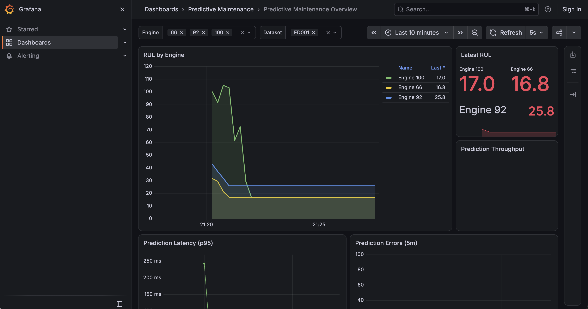
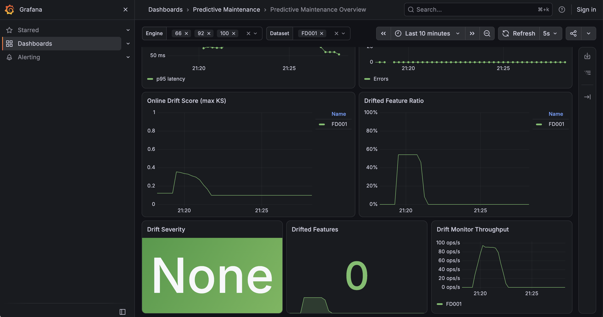
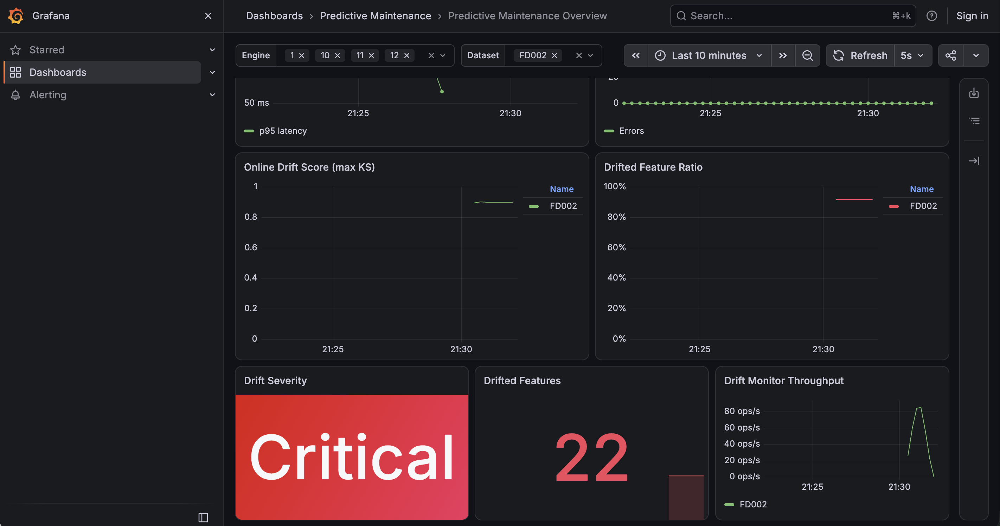
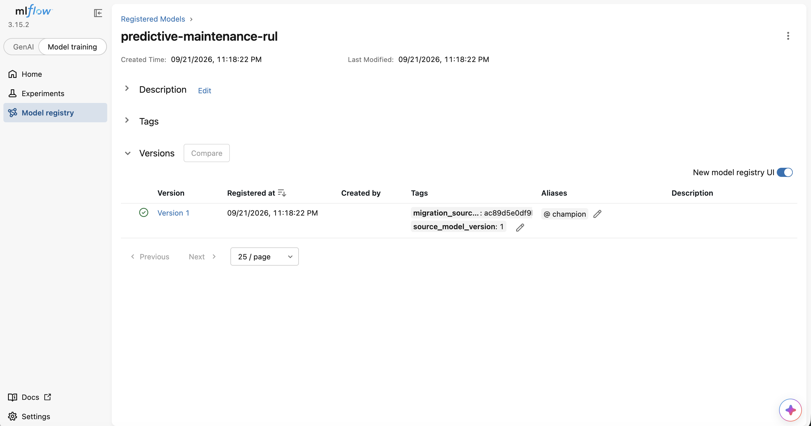
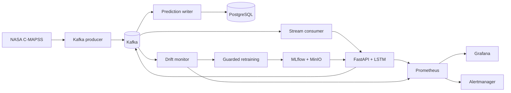

# Real-Time Predictive Maintenance ML Platform

[](https://github.com/CCao666/predictive-maintenance-mlops/actions/workflows/ci.yml)

An end-to-end MLOps project that predicts remaining useful life (RUL) from NASA
C-MAPSS turbofan sensor streams. It connects model training and registration,
real-time Kafka inference, persistent predictions, drift detection, operational
alerts, observability, and a local Kubernetes deployment.

## Demo

### Real-time RUL prediction

Sensor readings are replayed through Kafka. The consumer maintains a separate
50-cycle window for each engine and sends ready sequences to the inference API.



### Online drift detection

FD001 acts as the reference distribution. Replaying FD002, which contains
additional operating conditions, produces a clear distribution shift.

| FD001 reference replay | FD002 shifted replay |
| --- | --- |
|  |  |

### Model registry

Inference loads the production candidate through the MLflow alias
`models:/predictive-maintenance-rul@champion`, rather than a hard-coded model
version.



## What this project demonstrates

- Leakage-safe time-series preprocessing and LSTM training on C-MAPSS FD001.
- MLflow experiment tracking, MinIO artifacts, and alias-based model promotion.
- FastAPI health, readiness, inference, and Prometheus metric endpoints.
- Kafka sensor replay, per-engine sequence windows, and PostgreSQL persistence.
- Online KS drift detection with a guarded, human-approved retraining workflow.
- Grafana dashboards and Alertmanager notifications with an audit trail.
- Docker Compose for stateful infrastructure and kind for stateless workloads.
- GitHub Actions validation, integration tests, container publishing, and a kind
  smoke test.

## Architecture



Only `inference-api` and `stream-consumer` move into Kubernetes. Kafka,
PostgreSQL, MLflow, MinIO, Prometheus, Grafana, Alertmanager, and supporting
workers remain in Docker Compose to keep the local deployment understandable.

## Reproduce locally with Docker Compose

### Prerequisites

- Python 3.10
- Docker Desktop with Docker Compose v2
- Git

The C-MAPSS data used by the project is already included under `data/cmapss/`.
Model weights and local service data are intentionally excluded from Git, so a
new clone trains and registers its own champion.

### 1. Install the Python environment

```bash
git clone https://github.com/CCao666/predictive-maintenance-mlops.git
cd predictive-maintenance-mlops
python3.10 -m venv .venv
source .venv/bin/activate
python -m pip install -r requirements.txt
cp .env.example .env
```

The values in `.env.example` are development-only defaults. Replace them before
using the stack on a shared network.

### 2. Start MLflow storage and tracking

```bash
docker compose up -d --build postgres minio minio-init mlflow
docker compose up -d --wait --wait-timeout 180 postgres minio mlflow
export MLFLOW_TRACKING_URI=http://127.0.0.1:5050
```

### 3. Train, select, and register a champion

```bash
python -m training.tune_lstm --epochs 60
python -m training.register_model
```

`tune_lstm` compares three fixed learning-rate and batch-size configurations,
writes `artifacts/parameter_selection.json`, and `register_model` assigns the
best run the `champion` alias. Training time depends on the available CPU, CUDA,
or Apple Silicon MPS device.

Optional official FD001 holdout evaluation:

```bash
python -m training.evaluate_test --log-to-mlflow
```

### 4. Start the complete streaming stack

```bash
docker compose up -d --build
docker compose ps
```

The default producer replays FD001 and exits when publishing is complete. The
broker, API, consumer, writers, monitoring services, and databases remain
running.

Verify the loaded model and follow the stream:

```bash
curl http://127.0.0.1:8000/health
curl http://127.0.0.1:8000/ready
curl http://127.0.0.1:8000/model-info
docker compose logs -f stream-consumer prediction-writer
```

### 5. Open the interfaces

| Interface | URL |
| --- | --- |
| Grafana dashboard | <http://127.0.0.1:3000> |
| MLflow | <http://127.0.0.1:5050> |
| FastAPI documentation | <http://127.0.0.1:8000/docs> |
| Prometheus | <http://127.0.0.1:9090> |
| Alertmanager | <http://127.0.0.1:9093> |
| MinIO console | <http://127.0.0.1:9001> |

Grafana allows anonymous local viewing. Its development administrator login is
`admin` / `admin` and must be changed before a shared deployment.

### 6. Reproduce the FD002 drift demonstration

Restart the monitor to begin with an empty in-memory window, then replay FD002:

```bash
docker compose restart drift-monitor
docker compose run --rm --no-deps stream-producer \
  python -m streaming.producer \
  --data data/cmapss/test_FD002.txt \
  --dataset-id FD002 \
  --limit 5000 \
  --delay 0.005
```

In Grafana, select `FD002` in the Dataset control. After the minimum drift
window is populated, the dashboard shows the KS score, drifted-feature ratio,
severity, feature count, and monitor throughput.

### 7. Stop the stack

```bash
docker compose down
```

Named volumes retain PostgreSQL, MLflow, MinIO, Prometheus, Grafana, and
Alertmanager state. Use `docker compose down --volumes` only when that local data
should be erased.

## Model

### Why LSTM?

RUL is a sequence-regression problem: the meaning of a sensor value depends on
how it changes across earlier operating cycles. An LSTM is a practical choice
for this project because it:

- learns temporal degradation patterns instead of treating cycles as unrelated
  rows;
- preserves longer-range context while controlling the vanishing-gradient
  problem of a basic recurrent network;
- supports variable engine histories through fixed rolling windows; and
- provides a well-understood baseline whose behavior can be monitored and
  deployed without the complexity of a larger Transformer.

This is an engineering baseline, not a claim that LSTM is universally optimal.
Tree ensembles are useful for feature-engineered tabular baselines, while TCNs
or Transformers may perform better with broader datasets and systematic model
comparison.

### Architecture and training safeguards

The PyTorch model receives 50 cycles x 24 features, passes them through three
LSTM layers (`128 -> 64 -> 32`), applies learned attention pooling, and uses a
dense regression head (`64 -> 32 -> 16 -> 1`) to predict RUL.

Training includes:

- engine-level train/validation splitting to prevent one engine leaking across
  both sets;
- a `RobustScaler` fitted only on training engines;
- capped training labels (`max_rul=125`);
- dropout, gradient clipping, early stopping, and learning-rate reduction; and
- deterministic seeds plus MLflow logging for reproducibility.

The official test evaluation makes one final prediction per engine and reports
RMSE, MAE, and the asymmetric NASA score. Short sequences are left-padded before
scaling to match inference behavior.

## Kubernetes on a local kind cluster

This optional path runs the stateless API and stream consumer in kind while
keeping stateful services in Compose.

Additional prerequisites: `kind` and `kubectl`.

```bash
./scripts/bootstrap_demo.sh

export MLFLOW_TRACKING_URI=http://127.0.0.1:5050
python -m training.tune_lstm --epochs 60
python -m training.register_model

./scripts/deploy_kind.sh
./scripts/verify_demo.sh
```

The deployment script creates or reuses the cluster, loads the local image,
installs Metrics Server, creates the Kubernetes Secret from `.env`, applies the
Kustomize resources, and waits for both Deployments. The manifests include two
API replicas, rolling updates, health/readiness probes, resource requests and
limits, an HPA, and ConfigMap-based non-sensitive configuration.

For local API access, keep this running in a separate terminal:

```bash
kubectl port-forward -n predictive-maintenance service/inference-api 8000:8000
```

Clean up the kind demo without deleting persistent Docker volumes:

```bash
./scripts/cleanup_demo.sh
```

## Streaming and persistence

Kafka is exposed to host tools at `localhost:9092`; Compose services use
`kafka:19092`. The stream consumer maintains an independent window for every
engine and publishes successful predictions to `engine-rul-predictions`.

Inspect recent PostgreSQL predictions:

```bash
docker compose exec postgres psql -U maintenance -d maintenance -c \
  "SELECT dataset_id, engine_id, time_cycle, predicted_rul, alert_level, predicted_at FROM rul_predictions ORDER BY predicted_at DESC LIMIT 20;"
```

The table is idempotent by dataset, engine, cycle, and model version, so a replay
updates the same logical prediction instead of creating a duplicate.

## Monitoring and drift

Prometheus scrapes inference metrics every two seconds and retains seven days of
local history. Grafana is provisioned with engine and dataset controls, RUL
history, latest RUL, throughput, p95 latency, errors, and online drift panels.

The drift detector compares the 3 operating settings and 21 sensor features
against FD001 training data using a two-sample Kolmogorov-Smirnov test. A feature
is considered drifted when `p < 0.05` and KS statistic `>= 0.20`. Requiring both
conditions prevents large samples from turning negligible shifts into alerts.

Run the offline comparison across all four C-MAPSS datasets:

```bash
python -m monitoring.evaluate_drift
```

The online monitor waits for 1,000 observations, retains a rolling window of
5,000, rechecks every 500 observations, publishes results to
`model-drift-events`, and exposes metrics at <http://127.0.0.1:8081/metrics>.

## Alerts and operating actions

Prometheus evaluates the latest fresh prediction for every engine. A prediction
older than five minutes is excluded from RUL alerts. A separate stale-data alert
fires when the entire prediction stream has been silent for five minutes.
Alertmanager groups repeated notifications and sends firing and resolved states
to the local webhook, which stores them in PostgreSQL.

| Predicted RUL | Level | Suggested action |
| --- | --- | --- |
| `<= 15` | Urgent | Inspect immediately; assess derating or safe shutdown. |
| `15 < RUL <= 40` | Critical | Schedule maintenance at the earliest safe opportunity. |
| `40 < RUL <= 50` | Warning | Create a work order and increase inspection frequency. |
| `50 < RUL <= 60` | Watch | Review the trend and maintenance capacity. |
| `> 60` | Healthy | Continue normal monitoring. |

These thresholds are conservative operational policy, not proof that an engine
is safe. They should be calibrated with failure cost, inspection capacity, and
real fleet data before deployment. The stack also alerts on inference downtime,
prediction errors, high p95 latency, stale or missing prediction data,
`DataDriftWarning`, `DataDriftCritical`, `DriftMonitorDown`, and
`DriftChecksStale`.

Inspect persisted alert history:

```bash
docker compose exec postgres psql -U maintenance -d maintenance -c \
  "SELECT status, severity, alert_name, engine_id, summary, last_received_at FROM alerts ORDER BY last_received_at DESC;"
```

For this local simulation the webhook is the notification receiver. A real
deployment would add an authenticated on-call receiver such as PagerDuty, Slack,
or email without changing the Prometheus rules.

## Guarded retraining and promotion

Every drift event is stored in `drift_reports`. Three consecutive critical
checks create one `pending_review` request, with a 24-hour cooldown and no
duplicate active request. Drift detection never starts training or replaces the
production model automatically.

The approved candidate combines FD001 with the affected dataset and must improve
affected-dataset RMSE by at least 5% without worsening its NASA score or severe
overestimates. On the FD001 holdout, RMSE degradation is limited to 3%, with no
worse NASA score or severe overestimates. Passing creates a `challenger`; moving
the `champion` alias remains an explicit operator action.

```bash
python -m training.retrain_candidate approve <request-id>
python -m training.retrain_candidate train <request-id> --epochs 60
python -m training.retrain_candidate promote <request-id>
```

## Testing and CI/CD

Run the fast local suite:

```bash
python -m pytest -q
```

GitHub Actions:

- runs unit tests and three isolated end-to-end paths;
- validates Compose, Kubernetes, Prometheus, and Alertmanager configuration;
- checks manifests with Kustomize and kubeconform;
- creates a real kind cluster to test rollout, probes, service routing, and Pod
  replacement; and
- publishes multi-architecture API and MLflow images after successful pushes to
  `main`.

Published images:

- `ghcr.io/ccao666/predictive-maintenance-api`
- `ghcr.io/ccao666/predictive-maintenance-mlflow`

Images receive `main`, `latest`, and immutable `sha-<commit>` tags. Pull requests
run validation only and never publish images.

Run the complete integration suite locally (requires Docker):

```bash
docker build -t predictive-maintenance-ci:latest .
docker compose -f compose.ci.yaml up -d --wait --wait-timeout 180 postgres kafka inference-api drift-monitor alert-webhook alertmanager prometheus
docker compose -f compose.ci.yaml up -d stream-consumer prediction-writer retrain-coordinator
RUN_INTEGRATION_TESTS=1 python -m pytest tests/integration -v
docker compose -f compose.ci.yaml down --volumes --remove-orphans
```

Deploy an immutable image set to a Docker Compose staging host:

```bash
cp .env.example .env
IMAGE_TAG=sha-<commit> sh scripts/deploy_staging.sh
```

## Repository map

```text
inference/       FastAPI service and MLflow model loader
streaming/       Kafka producer, consumer, windows, and prediction writer
training/        Data preparation, LSTM training, evaluation, and promotion
monitoring/      Drift monitor, alert webhook, and offline drift evaluation
k8s/             Kustomize-managed local Kubernetes resources
grafana/         Provisioned dashboard and data source
prometheus/      Scrape configuration and alert rules
scripts/         Bootstrap, deployment, verification, and cleanup helpers
tests/           Unit and integration tests
```

`upstream-reference/` is read-only reference material and is not part of the
project implementation.
